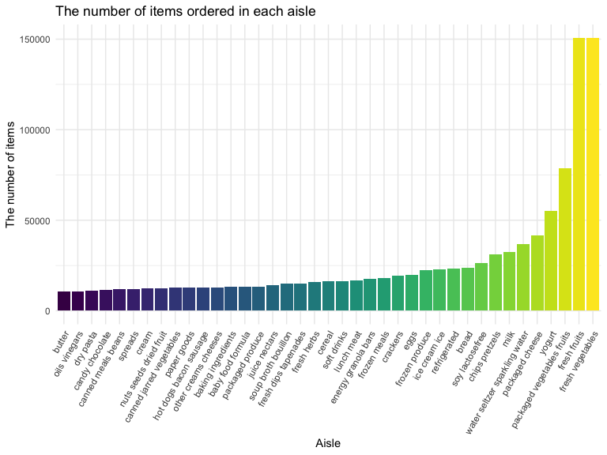
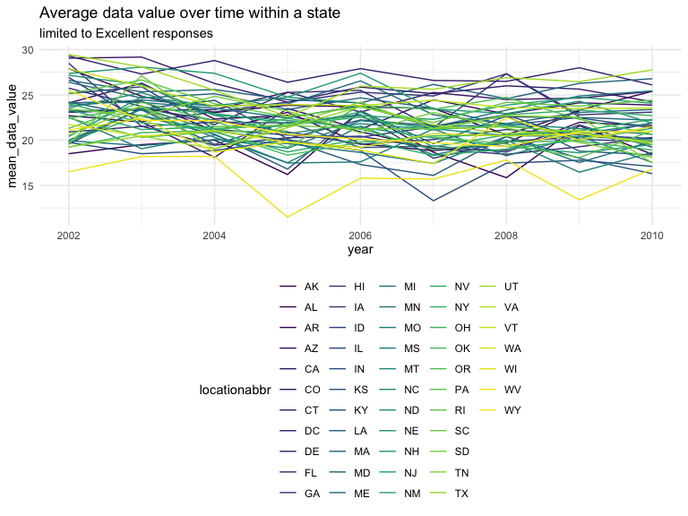
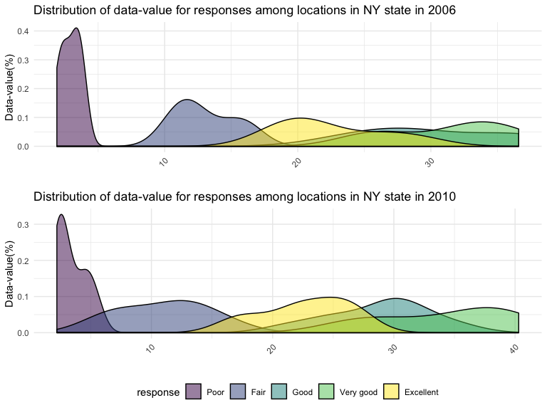

P8105\_hw3\_gl2677
================
Gaotong LIU
10/5/2019

## Problem 1

There are 1,384,617 observations of 131,209 unique users and 15 vaiables
in the `instacart` dataset, where each row is a product from an order.
The key variables are the ID and name of product, aisle, department,
together with the hour of the day and the day of the week on which the
order was placed.

Here is an illstrative example of observations. The first 8 rows are
from the same order with ID numerber `1` for the user with ID numerber
`112108`. This is the `4`th order this user has placed, and it has been
`9` days since the last order. In this order, there are total 8
products. The `1`st product added to cart was `Bulgarian Yogurt` with ID
number `49302` from `yogurt` aisle with ID number`120`, `dairy eggs`
department with ID number `16`. This producthas been ordered by this
user in the past and it was placed on `10` o’clock, `Thursday` this
time.

``` r
data("instacart")
instacart %>% 
  group_by(aisle) %>% 
  summarize(n = n()) %>% 
  arrange(desc(n))
```

  - There are totally 134 aisles in the dataset. `fresh vegetables` are
    the most items ordered from, and the majority of items are ordered
    from `fresh vegetables` and `fresh fruits`.

<!-- end list -->

``` r
instacart %>% 
  group_by(aisle) %>% 
  summarize(n = n()) %>% 
  filter(n > 10000) %>% 
  mutate(aisle = forcats::fct_reorder(aisle, n)) %>% 
  ggplot(aes(x = aisle, y = n, fill = aisle)) +
  geom_bar(stat = "identity") +
  labs(title = "The number of items ordered in each aisle",
       x = "Aisle",
       y = "The number of items") +
  theme(axis.text.x = element_text(angle = 60, hjust = 1),
        legend.position = "none")
```



  - From the plot, it shows most of items ordered in `fresh vegetables`,
    `fresh fruits`, and `packaged vegetables fruits`, and totally around
    375,000 items are oredered in these three aisles. People mainly use
    The Instacart Online Grocery Shopping to buy vegetables and fruits
    in 2017.

<!-- end list -->

``` r
instacart %>% 
  filter(aisle == c("baking ingredients","dog food care", "packaged vegetables fruits")) %>%
  group_by(product_name, aisle) %>% 
  summarize(n = n()) %>% 
  group_by(aisle) %>% 
  filter(min_rank(desc(n)) <= 3) %>%
  arrange(aisle) %>% 
  ungroup() %>%
  select(-aisle) %>% 
  pivot_wider(names_from = product_name,
              values_from = n) %>% 
  knitr::kable(caption = "The number of times each item is ordered against the three most popular items in each aisle.") %>% 
  add_header_above(c("baking ingredients" = 3,"dog food care" = 3, "packaged vegetables fruits" = 3))
```

<table>

<caption>

The number of times each item is ordered against the three most popular
items in each
aisle.

</caption>

<thead>

<tr>

<th style="border-bottom:hidden; padding-bottom:0; padding-left:3px;padding-right:3px;text-align: center; " colspan="3">

<div style="border-bottom: 1px solid #ddd; padding-bottom: 5px; ">

baking
ingredients

</div>

</th>

<th style="border-bottom:hidden; padding-bottom:0; padding-left:3px;padding-right:3px;text-align: center; " colspan="3">

<div style="border-bottom: 1px solid #ddd; padding-bottom: 5px; ">

dog food
care

</div>

</th>

<th style="border-bottom:hidden; padding-bottom:0; padding-left:3px;padding-right:3px;text-align: center; " colspan="3">

<div style="border-bottom: 1px solid #ddd; padding-bottom: 5px; ">

packaged vegetables fruits

</div>

</th>

</tr>

<tr>

<th style="text-align:right;">

Light Brown Sugar

</th>

<th style="text-align:right;">

Organic Vanilla Extract

</th>

<th style="text-align:right;">

Pure Baking Soda

</th>

<th style="text-align:right;">

Organix Chicken & Brown Rice Recipe

</th>

<th style="text-align:right;">

Organix Grain Free Chicken & Vegetable Dog Food

</th>

<th style="text-align:right;">

Original Dry Dog

</th>

<th style="text-align:right;">

Organic Baby Spinach

</th>

<th style="text-align:right;">

Organic Blueberries

</th>

<th style="text-align:right;">

Organic Raspberries

</th>

</tr>

</thead>

<tbody>

<tr>

<td style="text-align:right;">

157

</td>

<td style="text-align:right;">

122

</td>

<td style="text-align:right;">

140

</td>

<td style="text-align:right;">

13

</td>

<td style="text-align:right;">

14

</td>

<td style="text-align:right;">

9

</td>

<td style="text-align:right;">

3324

</td>

<td style="text-align:right;">

1692

</td>

<td style="text-align:right;">

1920

</td>

</tr>

</tbody>

</table>

  - `packaged vegetables fruits` is the most frequently ordered aisles,
    and `dog food care` is the least frequently ordered ones. Organic
    ingredients are often picked in these three aisles.

<!-- end list -->

``` r
instacart %>% 
  filter(product_name %in% c("Pink Lady Apples","Coffee Ice Cream")) %>%
  group_by(product_name, order_dow) %>% 
  summarize(mean_h = round(mean(order_hour_of_day))) %>% 
  mutate(order_dow = recode(order_dow, `0` = "Sunday",
                            `1` = "Monday",
                            `2` = "Tuesday",
                            `3` = "Wednesday",
                            `4` = "Thursday",
                            `5` = "Friday",
                            `6` = "Saturday"),
         mean_h = str_c(mean_h, "00", sep = ":")) %>%
  pivot_wider(names_from = order_dow,
              values_from = mean_h) %>% 
  knitr::kable(caption = "The mean hour of the day at which Pink Lady Apples and Coffee Ice Cream are ordered") 
```

<table>

<caption>

The mean hour of the day at which Pink Lady Apples and Coffee Ice Cream
are ordered

</caption>

<thead>

<tr>

<th style="text-align:left;">

product\_name

</th>

<th style="text-align:left;">

Sunday

</th>

<th style="text-align:left;">

Monday

</th>

<th style="text-align:left;">

Tuesday

</th>

<th style="text-align:left;">

Wednesday

</th>

<th style="text-align:left;">

Thursday

</th>

<th style="text-align:left;">

Friday

</th>

<th style="text-align:left;">

Saturday

</th>

</tr>

</thead>

<tbody>

<tr>

<td style="text-align:left;">

Coffee Ice Cream

</td>

<td style="text-align:left;">

14:00

</td>

<td style="text-align:left;">

14:00

</td>

<td style="text-align:left;">

15:00

</td>

<td style="text-align:left;">

15:00

</td>

<td style="text-align:left;">

15:00

</td>

<td style="text-align:left;">

12:00

</td>

<td style="text-align:left;">

14:00

</td>

</tr>

<tr>

<td style="text-align:left;">

Pink Lady Apples

</td>

<td style="text-align:left;">

13:00

</td>

<td style="text-align:left;">

11:00

</td>

<td style="text-align:left;">

12:00

</td>

<td style="text-align:left;">

14:00

</td>

<td style="text-align:left;">

12:00

</td>

<td style="text-align:left;">

13:00

</td>

<td style="text-align:left;">

12:00

</td>

</tr>

</tbody>

</table>

  - Most of `Coffee Ice Cream` is ordered between two o’clock and three
    o’clock in the afternoon during the week. `Pink Lady Apples` is
    ordered with unfixed time, which is between eleven o’clock in the
    morning and two o’clock in the afternoon.

## Problem 2

``` r
data("brfss_smart2010")
overall_health = brfss_smart2010 %>% 
  janitor::clean_names() %>% 
  filter(topic == "Overall Health" & response !="Very good") %>% 
  mutate(response = forcats::fct_relevel(response, c("Poor", "Good", "Fair", "Excellent"))) 
```

``` r
states_2002 = overall_health %>% 
  filter(year == 2002) %>% 
  group_by(locationabbr) %>% 
  summarize(n = n()) %>% 
  filter(n >= 7) %>% 
  pull(locationabbr)

states_2010 = overall_health %>% 
  filter(year == 2010) %>% 
  group_by(locationabbr) %>% 
  summarize(n = n()) %>% 
  filter(n >= 7) %>% 
  pull(locationabbr)
```

  - In 2002, total `36` states (`AZ, CO, CT, DE, FL, GA, HI, ID, IL, IN,
    KS, LA, MA, MD, ME, MI, MN, MO, NC, NE, NH, NJ, NV, NY, OH, OK, OR,
    PA, RI, SC, SD, TN, TX, UT, VT, WA`) were observed at 7 or more
    locations. In 2010, total `45` states (`AL, AR, AZ, CA, CO, CT, DE,
    FL, GA, HI, IA, ID, IL, IN, KS, LA, MA, MD, ME, MI, MN, MO, MS, MT,
    NC, ND, NE, NH, NJ, NM, NV, NY, OH, OK, OR, PA, RI, SC, SD, TN, TX,
    UT, VT, WA, WY`) were observed at 7 or more locations.

<!-- end list -->

``` r
overall_health %>% 
  filter(response == "Excellent") %>% 
  group_by(locationabbr,year) %>% 
  summarize(mean_data_value = mean(data_value)) %>% 
  ggplot(aes(x = year, y = mean_data_value, color = locationabbr)) +
  geom_line() +
  labs(title = "Average data value over time within a state",
       subtitle = "limited to Excellent responses")
```



``` r
data_value_2006 = overall_health %>%
  filter(year == 2006) %>% 
  filter(locationabbr == "NY") %>% 
  group_by(response) %>% 
  ggplot(aes(x = locationdesc, y = data_value, 
             color = response, group = response)) +
  geom_point() +
  geom_line() +
  theme(axis.text.x = element_text(angle = 45,hjust = 1),
        legend.position = "none") +
  labs(title = "Distribution of data_value for responses among locations in NY State in 2006",
       x = "")

data_value_2010 = overall_health %>%
  filter(year == 2010) %>% 
  filter(locationabbr == "NY") %>% 
  group_by(response) %>% 
  ggplot(aes(x = locationdesc, y = data_value, 
             color = response, group = response)) +
  geom_point() +
  geom_line() +
  theme(axis.text.x = element_text(angle = 45,hjust = 1))+
  labs(title = "Distribution of data_value for responses among locations in NY State in 2010",
       x = "")
data_value_2006 / data_value_2010
```



## Problem 3

``` r
activity = read_csv("./data/accel_data.csv") %>% 
  janitor::clean_names() %>% 
  pivot_longer(activity_1:activity_1440, 
               names_to = "minute",
               names_prefix = "activity_",
               values_to = "minute_activity") %>% 
  mutate(minute = as.numeric(minute),
         week = as.factor(week),
         hour = minute %/% 60,
         weekday = factor(day %in% c("Sunday", "Saturday"), 
                          levels = c(TRUE, FALSE), 
                          labels = c("weekend", "weekday")),
         day = forcats::fct_relevel(day, c("Monday", "Tuesday", "Wednesday", "Thursday", "Friday", "Saturday","Sunday")))   
```

  - There are 50400 observations and 7 variables in `acticity` dataset.
    The variables are week, day\_id, day, minute, minute\_activity,
    hour, weekday. For each observation, the dataset shows the activity
    counts for the exact minute of a 24-hour day starting at midnight on
    exact day and exact week.

<!-- end list -->

``` r
activity %>% 
  group_by(week, day) %>% 
  summarize(day_activity = sum(minute_activity)) %>% 
  pivot_wider(names_from = day,
              values_from = day_activity) %>% 
  knitr::kable(digits = 0) 
```

<table>

<thead>

<tr>

<th style="text-align:left;">

week

</th>

<th style="text-align:right;">

Monday

</th>

<th style="text-align:right;">

Tuesday

</th>

<th style="text-align:right;">

Wednesday

</th>

<th style="text-align:right;">

Thursday

</th>

<th style="text-align:right;">

Friday

</th>

<th style="text-align:right;">

Saturday

</th>

<th style="text-align:right;">

Sunday

</th>

</tr>

</thead>

<tbody>

<tr>

<td style="text-align:left;">

1

</td>

<td style="text-align:right;">

78828

</td>

<td style="text-align:right;">

307094

</td>

<td style="text-align:right;">

340115

</td>

<td style="text-align:right;">

355924

</td>

<td style="text-align:right;">

480543

</td>

<td style="text-align:right;">

376254

</td>

<td style="text-align:right;">

631105

</td>

</tr>

<tr>

<td style="text-align:left;">

2

</td>

<td style="text-align:right;">

295431

</td>

<td style="text-align:right;">

423245

</td>

<td style="text-align:right;">

440962

</td>

<td style="text-align:right;">

474048

</td>

<td style="text-align:right;">

568839

</td>

<td style="text-align:right;">

607175

</td>

<td style="text-align:right;">

422018

</td>

</tr>

<tr>

<td style="text-align:left;">

3

</td>

<td style="text-align:right;">

685910

</td>

<td style="text-align:right;">

381507

</td>

<td style="text-align:right;">

468869

</td>

<td style="text-align:right;">

371230

</td>

<td style="text-align:right;">

467420

</td>

<td style="text-align:right;">

382928

</td>

<td style="text-align:right;">

467052

</td>

</tr>

<tr>

<td style="text-align:left;">

4

</td>

<td style="text-align:right;">

409450

</td>

<td style="text-align:right;">

319568

</td>

<td style="text-align:right;">

434460

</td>

<td style="text-align:right;">

340291

</td>

<td style="text-align:right;">

154049

</td>

<td style="text-align:right;">

1440

</td>

<td style="text-align:right;">

260617

</td>

</tr>

<tr>

<td style="text-align:left;">

5

</td>

<td style="text-align:right;">

389080

</td>

<td style="text-align:right;">

367824

</td>

<td style="text-align:right;">

445366

</td>

<td style="text-align:right;">

549658

</td>

<td style="text-align:right;">

620860

</td>

<td style="text-align:right;">

1440

</td>

<td style="text-align:right;">

138421

</td>

</tr>

</tbody>

</table>

``` r
day_plot = activity %>% 
  group_by(week, day) %>% 
  summarize(day_activity = sum(minute_activity)) %>% 
  ggplot(aes(x = day, y = day_activity, color = week, group = week)) +
  geom_point() +
  geom_line()
```

  - The accelerometer acticity counts for all five weeks increase on
    Wednesday comparing to Tuesday. and they all are numerically similar
    between Tuesday and Thursay. The activity counts on Saturday drop to
    the same value in week 4 and week 5.

<!-- end list -->

``` r
activity %>% 
  group_by(day, hour) %>% 
  summarize(mean_hour_activity = mean(minute_activity)) %>% 
  ggplot(aes(x = hour, y = mean_hour_activity,
             color = day, group = day)) +
  geom_point(alpha = .3) +
  geom_line() +
  xlim(0, 24)
```


  - Describe in words any patterns or conclusions you can make based on
    this graph.
