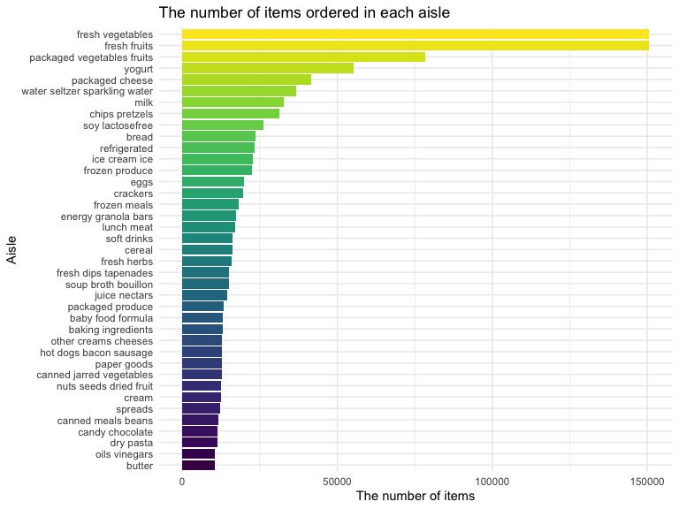

P8105\_hw3\_gl2677
================
Gaotong LIU
10/5/2019

## Problem 0

describing some key variables, and giving illstrative examples of
observations. There are 1,384,617 observations of 131,209 unique users
and 15 vaiables in the `instacart` dataset, where each row is a product
from an order. The key variables are

``` r
aisle = instacart %>% 
  group_by(aisle) %>% 
  summarize(n = n()) 
aisle %>% 
  filter(min_rank(desc(n)) == 1)
```

  - There are 134 aisles are in the dataset, and `fresh vegetables` are
    the most items ordered from.

<!-- end list -->

``` r
instacart %>% 
  mutate(aisle_id = as.character(aisle_id),
         aisle_name_id = paste(aisle, aisle_id, sep = "-")) %>% 
  group_by(aisle_id, aisle_name_id) %>% 
  summarize(n = n()) %>% 
  filter(n > 10000) %>% 
  ungroup %>% 
  mutate(aisle_id = forcats::fct_reorder(aisle_id, n))  %>% 
  ggplot(aes(x = aisle_id, y = n, fill = aisle_name_id)) +
  geom_bar(stat = "identity") +
  viridis::scale_fill_viridis(discrete = TRUE) +
  labs(title = "The number of items ordered in each aisle",
       x = "Aisle-id",
       y = "The number of items",
       fill = "") +
  theme(legend.key.size = unit(0.1, "cm")) +
  guides(fill = guide_legend(nrow = 10, byrow = TRUE))
```


